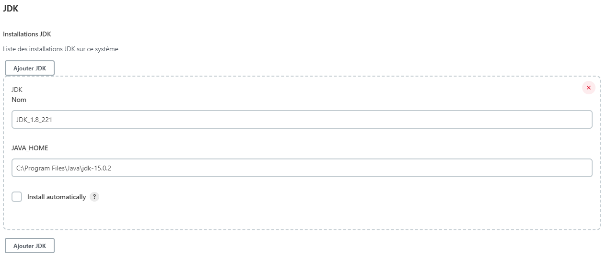

# Jenkins

## Configuration

Allez dans _Manage Jenkins_ : `http://{jenkins host}:{jenins port}/manage`<br/>
Puis allez dans _Configuration globale des outils_ : `http://{jenkins host}:{jenins port}/configureTools`<br/>

<br/>
Comme dans l'image ci-dessus aller dans la partie `JDK` et déocher `Install automatically` puis recupere dans vos variable d'environnement la valeur de la variable `JAVA_HOME` et coller la dans Jenkins dans la partie `JAVA_HOME`<br/>
<br/>

<br/>
Comme dans l'image ci-dessus aller dans la partie `Maven` et déocher `Install automatically` puis recupere dans vos variable d'environnement la valeur de la variable `M3_HOME` et coller la dans Jenkins dans la partie `MAVEN_HOME`<br/>

Les noms que vous mettrez dans les champs nom seron ceux que vous mettrez dans la partie `tools` de votre `Jenkinsfile`.<br/>
<br/>

## Job

<br/>

## Jenkinsfile
```jenkinsfile
pipeline {
    agent any
    tools {
        jdk 'JDK_1.8_221'
        maven 'MavenInstallation'
    }
    environment {
        String branchName = "main"
        String repoUrl = "https://github.com/Chatbrume/ManagerAccount.git"
    }
    stages {
        stage('Checkout') {
            steps {
                script {
                    echo 'Cloning the "'+branchName+'" branch from "'+repoUrl+'".'
                    echo 'Start cloning the github repository...'
                    git branch: branchName, url: repoUrl
                    echo 'repository clone on branch master done.'
                }
            }
        }
        stage('Test') {
            steps {
                script {
                    echo 'Execute all test...'
                    withMaven {
                        bat "mvn clean test"
                    }
                    echo 'End of the execution'
                }
            }
            post {
                success {
                        junit '**/target/surefire-reports/*.xml'
                }
                failure {
                    mail bcc: '', body: '''Please check this job : ${JOB_URL}
                    Your partner Jenkins''', cc: '', from: '', replyTo: '', subject: 'Build ${BUILD_TAG} Failed ', to: 'appiciel@outlook.fr'
                }
            }
        }
        stage('generate javadoc') {
            steps {
                script {
                    echo 'Generation of the javadoc...'
                    withMaven {
                        bat "mvn javadoc:javadoc"
                    }
                    echo 'The javadoc have been generated !'
                }
            }

        }
        stage('confirmation email') {
            steps {
                emailext to: "nioche.amelie@gmail.com", subject: "[Jenkins] ManagerAccount", body: "ManagerAccount jenkins pipeline build finished with success"
                echo 'An email have been send ! Consult your email adress !'
            }
        }
    }
}
```